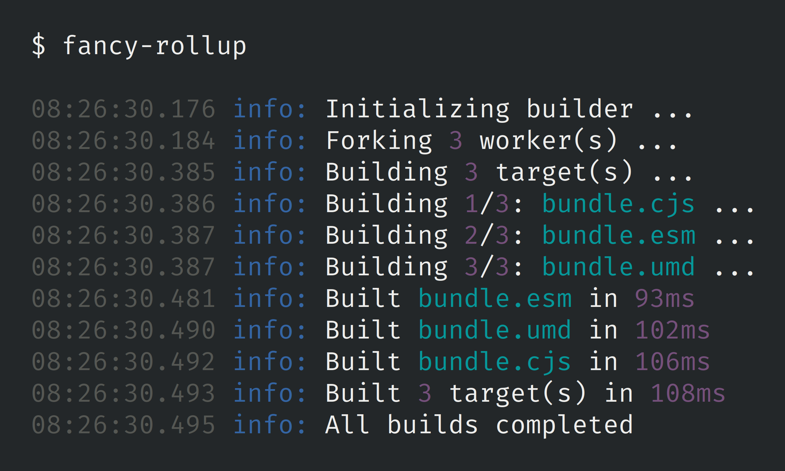

# fancy-rollup

[](https://www.npmjs.com/package/fancy-rollup) [](https://david-dm.org/timdp/fancy-rollup) [](https://standardjs.com/)

Multi-process [Rollup](https://rollupjs.org/) wrapper.



## Purpose

Rollup has the ability to create multiple bundles from a single invocation of
the `rollup` command. All you need to do is export an array of build
configurations from your configuration file. Great, right?

Well, using this method, a single Rollup process will simply create all the
configured bundles in sequence. Unfortunately, that can get pretty slow.
Computers are great at parallelization, so what you probably want to do instead
is run your builds concurrently.

To accomplish that, you _could_ create a configuration file per build and invoke
`rollup` once for each of those files. Once you've figured out how to coordinate
all that, you'd probably turn your attention to reporting progress from each of
the builds in a comprehensive way.

What fancy-rollup does is handle all this for you. Firstly, it will start
multiple Node processes that each run Rollup, using all of your machine's
available processing power and dramatically speeding up builds. Secondly, it
comes with multiple reporters that provide a nice overview of build progress.

## Installation

For convenience, you can install fancy-rollup globally:

```bash
yarn global add fancy-rollup
```

However, you probably want to make it a devDependency of your package instead:

```bash
yarn add fancy-rollup --dev
```

## Configuration

Like Rollup itself, fancy-rollup will read `rollup.config.js` in the current
working directory. Just export an array of build configurations and you're good
to go.

## Usage

Simply invoke fancy-rollup from the command line:

```bash
fancy-rollup
```

An API for invoking fancy-rollup from your JavaScript code is in the works.

## Options

| Option | Description |
|--------|-------------|
| <nobr>`-c <filename>`<br>`--config`</nobr> | Specify config file name. Identical to Rollup's option. |
| <nobr>`-t <id>`<br>`--target`</nobr> | Select targets to build. May be specified multiple times. Default is all. |
| <nobr>`-r <name>`<br>`--reporter`</nobr> | Select style for reporting progress. See below. |
| <nobr>`-p <number>`<br>`--concurrency`</nobr> | Limit number of concurrent builds. Default is one per CPU core. |
| <nobr>`-v`<br>`--version`</nobr> | Show version number. |
| <nobr>`-h`<br>`--help`</nobr> | Show help. |

## Reporters

| Reporter | Description |
|----------|-------------|
| `interactive` | Tailing logger with progress bar and timer. Default. |
| `dumb` | Tailing logger only. Default for non-TTY environments. |
| `simple` | Live-updating one-line status. |
| `list` | Live-updating checklist using [Listr](https://www.npmjs.com/package/listr). |
| `essential` | Rollup output only. |
| `silent` | No output. |

## Rollup Versioning

It's generally a good idea to lock down the version of Rollup that you want to
use for bundling. Specifying an exact version lets you avoid API inconsistencies
and other unexpected behavior.

This is accomplished by simply installing the correct `rollup` package alongside
fancy-rollup. In other words, put both of them in the same `package.json` file
so that `yarn` (or `npm install`) puts them under the same `node_modules`
directory.

If fancy-rollup cannot find `rollup` under the package directory's
`node_modules`, it will check the parent directory's, then that one's parent
directory's, etc. This is Node's standard module resolution in action.

If none of the parent directories contain a `rollup` installation either,
fancy-rollup will fall back to using its own version. You can check which one
that is by consulting [`package.json`](package.json).

## Author

[Tim De Pauw](https://tmdpw.eu/)

## License

MIT
